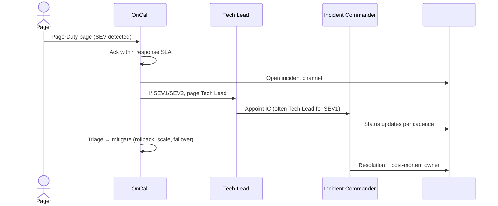
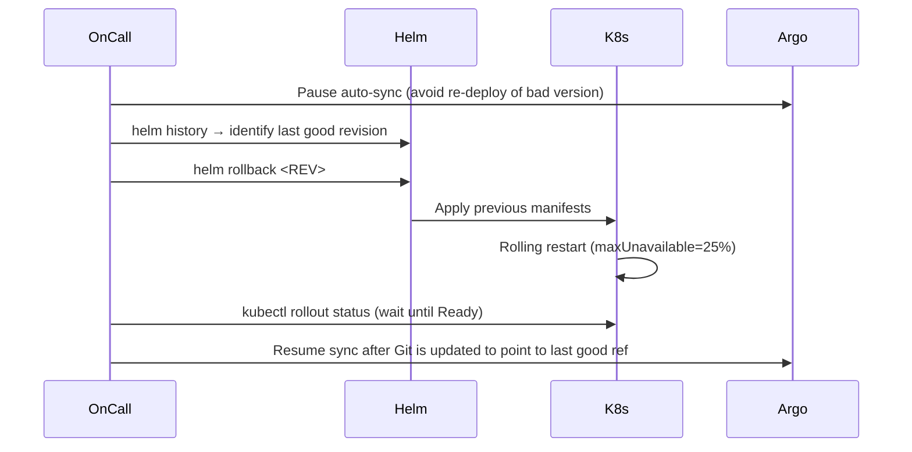

# Operations Runbook

> Production on-call playbook. Pair with [BACKUP_AND_DR.md](BACKUP_AND_DR.md) for disaster recovery.
> Back to [README](../README.md).

---

## 1. Service Health Dashboard

| Pane                        | URL (production)                                  | Purpose                                  |
|-----------------------------|---------------------------------------------------|------------------------------------------|
| Grafana — Platform Overview | `https://grafana.ecommerce.internal/d/platform`   | RPS, error rate, p95/p99 latency per svc |
| Grafana — Infra             | `https://grafana.ecommerce.internal/d/infra`      | DB, Redis, Kafka, ES                     |
| Loki                        | `https://grafana.ecommerce.internal/explore`      | Centralized logs (datasource: Loki)      |
| Eureka                      | `https://eureka.ecommerce.internal`               | Service registry / heartbeats            |
| Zipkin                      | `https://zipkin.ecommerce.internal`               | Distributed traces                       |
| Prometheus                  | `https://prometheus.ecommerce.internal`           | Raw metrics, alert rule status           |
| Alertmanager                | `https://alertmanager.ecommerce.internal`         | Active alerts, silences                  |
| ArgoCD                      | `https://argocd.ecommerce.internal`               | GitOps deploy state                      |

Local equivalents in dev: Grafana `:3000`, Eureka `:8761`, Zipkin `:9411`, Prometheus `:9090`.

---

## 2. Common Alerts → Triage

| Alert                              | Likely cause                                         | First action                                                                                  | Escalate to     |
|------------------------------------|------------------------------------------------------|-----------------------------------------------------------------------------------------------|-----------------|
| `ServiceDown`                      | Pod crash-loop, OOM, deregistered from Eureka        | `kubectl get pods -n ecommerce-prod`, check restart count + recent logs in Loki               | Service owner   |
| `HighLatencyP95` (>500 ms 5 m)     | Slow downstream, DB lock, GC pause, cold cache       | Check Zipkin trace for the slow span; check Grafana DB latency panel                          | Service owner   |
| `ErrorRateSpike` (>5% 5 m)         | Recent deploy regression, dependency outage          | Compare with deploy timeline; consider rollback (§4)                                          | Tech Lead       |
| `DBConnectionPoolExhausted`        | Long-running query, connection leak, traffic spike   | `SELECT * FROM pg_stat_activity WHERE state='active'`; kill stuck queries; bounce pod         | DBA + Tech Lead |
| `KafkaConsumerLag` (>10 k 5 m)     | Slow consumer, partition skew, broker degraded       | `kafka-consumer-groups --describe`; scale consumer; check broker disk                         | Service owner   |
| `RedisOOM` / `maxmemory_reached`   | Eviction policy missing, runaway TTL, memory leak    | `redis-cli INFO memory`; verify `maxmemory-policy=allkeys-lru`; flush scoped keys (§6)        | SRE             |
| `DiskPressureDataNode` (>85%)      | Logs/snapshot growth, WAL retention                  | Check `df -h` on data nodes; rotate logs; trim WAL/snapshots; expand PVC                      | SRE             |
| `CertExpiring` (<14 d)             | Cert-manager renewal failed                          | `kubectl describe certificate -n ecommerce-prod`; check ACME challenge                        | SRE             |
| `5xxFromGateway`                   | Upstream service down or rate-limited                | Identify upstream from gateway logs; correlate with `ServiceDown`                             | Service owner   |

---

## 3. Incident Severity Matrix

| Severity | Definition                                                         | Response time | Comms cadence       | Examples                                          |
|----------|--------------------------------------------------------------------|---------------|---------------------|---------------------------------------------------|
| SEV1     | Customer-facing outage; checkout/payment broken; data loss risk    | 15 min        | Every 30 min        | Gateway down; order DB unavailable; payment 100% errors |
| SEV2     | Major feature degraded; latency >2× SLO; partial region failure    | 30 min        | Every 60 min        | Search timing out; one region's read-replica down |
| SEV3     | Minor degradation; non-blocking bug; recoverable error             | 4 h (business) | End-of-day          | Email delays; admin dashboard chart broken        |



---

## 4. Rollback Procedures

### 4.1 Helm rollback (preferred)

```bash
helm history ecommerce -n ecommerce-prod
helm rollback ecommerce <REVISION> -n ecommerce-prod --wait --timeout 5m
kubectl get pods -n ecommerce-prod -w
```

### 4.2 kubectl rollout undo (single deployment)

```bash
kubectl rollout history deployment/<svc> -n ecommerce-prod
kubectl rollout undo deployment/<svc> -n ecommerce-prod --to-revision=<N>
kubectl rollout status deployment/<svc> -n ecommerce-prod
```

### 4.3 Pin previous image tag (image-only)

```bash
kubectl set image deployment/<svc> <svc>=ecommerce/<svc>:1.4.7 -n ecommerce-prod
kubectl annotate deployment/<svc> kubernetes.io/change-cause="Rollback to 1.4.7 — incident INC-2026-04-29" -n ecommerce-prod --overwrite
```



---

## 5. Database Migration Rollback

Flyway is forward-only by design. Recovery options:

1. **Repair a failed migration** (state mismatch, no data change yet):
   ```bash
   kubectl exec -it <svc-pod> -n ecommerce-prod -- /app/flyway-repair.sh
   # equivalent to: flyway repair
   ```
2. **Forward-fix** — write `Vnext__rollback.sql` that reverses the offending change. Always preferred over restore.
3. **Point-in-time restore** (data loss risk; coordinate with DBA):
   - PostgreSQL: `pg_restore` from latest base backup + replay WAL up to `--target-time '2026-04-29 14:30:00 UTC'`. Manifest in [BACKUP_AND_DR.md](BACKUP_AND_DR.md).
   - MySQL: restore latest mysqldump + binlog replay (`mysqlbinlog --stop-datetime`).
   - Mongo: `mongorestore` from latest dump + oplog replay.

Document every restore in the incident channel. Update Flyway `flyway_schema_history` if you skip versions.

---

## 6. Cache Invalidation

**Whole DB (last resort, scoped):**
```bash
kubectl exec -it redis-master-0 -n ecommerce-prod -- redis-cli -n <DB_INDEX> FLUSHDB
```

**Single key pattern:**
```bash
redis-cli --scan --pattern 'product:*' | xargs redis-cli DEL
```

**App-level cache busting** (product, promotion services expose admin endpoints):
```bash
curl -X POST -H "X-Admin-Token: $ADMIN_TOKEN" \
  https://api.ecommerce.internal/api/admin/cache/evict?namespace=products
```

Avoid `FLUSHALL` in production — wipes rate limiter buckets, sessions, etc.

---

## 7. Datastore Restart Procedures

| Datastore     | Procedure                                                                                                              |
|---------------|------------------------------------------------------------------------------------------------------------------------|
| PostgreSQL    | `kubectl rollout restart statefulset/postgres -n data`. Wait for replica catch-up (`pg_stat_replication.lag = 0`).     |
| MySQL         | `kubectl rollout restart statefulset/mysql -n data`. Validate replication on read-replicas with `SHOW SLAVE STATUS`.   |
| MongoDB       | Restart secondaries first, then primary (forces re-election): `kubectl delete pod mongodb-1 mongodb-2 -n data` then `mongodb-0`. |
| Redis         | If standalone: `kubectl delete pod redis-master-0 -n data`. If Sentinel: failover first via `redis-cli SENTINEL failover mymaster`. |
| Kafka         | Rolling restart one broker at a time; wait for under-replicated partitions = 0 between restarts.                       |
| Elasticsearch | Disable shard allocation: `PUT _cluster/settings {"persistent":{"cluster.routing.allocation.enable":"none"}}`. Restart node. Re-enable. |

Always check `Grafana → Infra` before and after; never restart two nodes of the same cluster simultaneously unless you're doing a full DR drill.

---

## 8. DR Drill — Quarterly Checklist

Owner rotates among SREs. Allocate ~3 h. Goal: verify RTO 4 h / RPO 1 h.

- [ ] Spin up DR environment from latest IaC (`terraform apply` in DR region).
- [ ] Restore Postgres from S3 base backup + WAL → run smoke test queries.
- [ ] Restore MySQL from latest dump + binlog → verify row counts.
- [ ] Restore Mongo from dump + oplog → verify collection counts.
- [ ] Re-create Elasticsearch indices via `_snapshot/restore`.
- [ ] Re-deploy backend services via Helm against DR databases.
- [ ] Run `e2e/` smoke suite against DR gateway.
- [ ] Measure end-to-end restore time; record in `docs/dr-drill-history.md`.
- [ ] Tear down DR environment.

Failures → file SEV3 internal ticket, retro within 1 week.

---

## 9. Contacts & Escalation

| Role                  | Channel / contact                              | When                            |
|-----------------------|------------------------------------------------|---------------------------------|
| Primary on-call       | PagerDuty schedule `Platform-Primary`          | All alerts                      |
| Secondary on-call     | PagerDuty schedule `Platform-Secondary`        | If primary doesn't ack in 10 m  |
| Tech Lead             | PagerDuty `Tech-Lead-Primary` / Slack `@tl-oncall` | SEV1, SEV2 mitigation guidance |
| DBA                   | Slack `#dba-oncall`, PagerDuty `DBA`           | DB-related SEV1/SEV2            |
| Security              | Slack `#security`, PagerDuty `Security-Primary`| Suspected breach, leaked secret |
| Engineering Manager   | Slack `@eng-mgr` / phone (in 1Password)        | SEV1 + customer comms needed    |
| Customer Support lead | Slack `#cs-leads`                              | Customer-impacting SEV1/SEV2    |

Pager runbook: <https://runbook.ecommerce.internal/oncall> (placeholder).
1Password vault: `Platform — On-Call`.
PagerDuty: `https://ecommerce.pagerduty.com/schedules`.

---

## 10. After the Incident

1. Resolve PagerDuty incident.
2. Open post-mortem doc within 24 h (template in `docs/templates/post-mortem.md` — TODO).
3. Schedule blameless retro within 1 week.
4. Track follow-up actions in Jira under epic `INCIDENT-FOLLOWUPS`.
5. Update this runbook if the response surfaced gaps.
