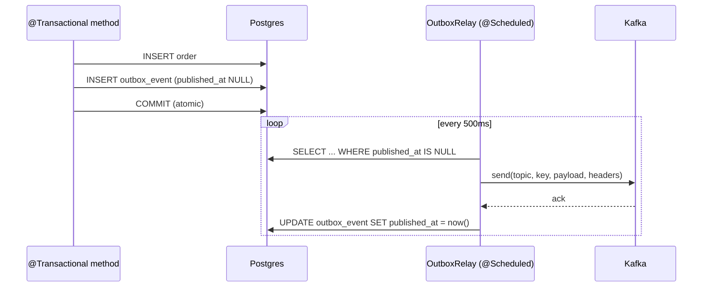

# Transactional Outbox Pattern

> **Applied:** 2026-04-30
> **Scope:** `order-service`, `payment-service`
> **Implementation:** Polling relay (Spring `@Scheduled`)
> **Future migration target:** Debezium CDC (see §6)

---

## 1. Why

Both services previously did a **dual-write**: a DB transaction commits the
domain change, then a separate `KafkaTemplate.send(...)` call publishes the
event. Two failure modes leaked:

1. DB commits → process crashes before Kafka send → event lost.
2. Kafka send acks → DB rollback fires → ghost event downstream.

Order events power notification-service emails, search-service indexing, and
inventory-service replenishment. Losing one means a user gets no order
confirmation, search returns stale data, or stock counts drift. Same risks
apply to payment-service `PAYMENT_COMPLETED` / `PAYMENT_FAILED` events that
drive the order-service refund saga.

The transactional outbox makes event publication **atomic with the domain
write** at the database level — no distributed transaction, no 2PC.

---

## 2. How

### 2.1 Schema

A single `outbox_event` table per service. Both services use Postgres — DDL
is identical and lives in `db/migration/V1__Create_outbox_table.sql` for each
service. JPA `ddl-auto: update` currently materialises the table; the SQL
file is the canonical contract for future Flyway adoption and for ops audits.

| column            | type           | purpose                                           |
|-------------------|----------------|---------------------------------------------------|
| `id`              | BIGSERIAL PK   | row identity                                      |
| `event_id`        | VARCHAR UNIQUE | UUID surfaced as `outbox-event-id` Kafka header   |
| `aggregate_type`  | VARCHAR        | `Order`, `Payment`                                |
| `aggregate_id`    | VARCHAR        | aggregate PK; used as Kafka partition key         |
| `event_type`      | VARCHAR        | `ORDER_CREATED`, `PAYMENT_FAILED`, etc.           |
| `topic`           | VARCHAR        | destination Kafka topic                           |
| `payload`         | TEXT           | Jackson-serialised event JSON                     |
| `created_at`      | TIMESTAMP      | enqueue time                                      |
| `published_at`    | TIMESTAMP NULL | non-null once relay confirms broker ack           |
| `attempt_count`   | INTEGER        | retry counter for stuck events                    |
| `last_error`      | VARCHAR(1024)  | most recent publish failure reason                |

Index `idx_outbox_unpublished (published_at, created_at)` drives the relay's
claim query.

### 2.2 Write path

```
@Transactional
public Order createOrder(...) {
    Order saved = orderRepository.save(order);
    orderEventPublisher.publishOrderCreatedEvent(saved); // -> outboxService.recordEvent
    return saved;
}
```

`OutboxService.recordEvent` is annotated `Propagation.MANDATORY` — calling
it outside an active transaction throws `IllegalTransactionStateException`.
That guard is the entire point of the pattern: the outbox row and the
aggregate row commit together or not at all.

### 2.3 Relay path



Each Kafka record carries two headers:

| header               | value                                |
|----------------------|--------------------------------------|
| `outbox-event-id`    | `event_id` UUID — consumer dedup key |
| `outbox-event-type`  | `event_type` string                  |

Consumers MUST be idempotent — at-least-once delivery is the contract.
order-service and promotion-service consumers already maintain dedup tables;
notification-service uses idempotent SMTP send semantics.

---

## 3. Failure modes covered

| Scenario                                                     | Before (dual-write) | After (outbox)             |
|--------------------------------------------------------------|---------------------|----------------------------|
| Process crashes after DB commit, before Kafka send           | event lost          | relay retries on next tick |
| Process crashes after Kafka ack, before DB commit            | ghost event         | row never committed        |
| Kafka unreachable for minutes                                | events lost / errors thrown to user | events queue in DB; flushed when broker returns |
| Network partition mid-send                                   | unknown state       | row stays unpublished; retried |
| Outbox-row INSERT fails inside the user transaction          | n/a                 | aggregate write rolls back too — no half-state |

What is **not** covered:

- Postgres data loss (covered by replication/backups, orthogonal).
- Consumer-side bugs (covered by idempotent consumer dedup tables).
- Long Kafka outages — `attempt_count` grows unbounded. Operators can:
  alert on `outbox.unpublished.count > N`; manually requeue or DLQ stuck rows
  by clearing `last_error` and resetting `attempt_count`.

---

## 4. Observability

### Metrics

`outbox.unpublished.count` — Micrometer gauge tagged `service=order-service`
or `service=payment-service`. Scraped by Prometheus via `/actuator/prometheus`.

Suggested alerts (set per-service SLOs):

- **WARN** if value > 100 sustained for 5 minutes (relay falling behind).
- **PAGE** if value > 1000 OR oldest-unpublished `created_at` is older than
  5 minutes.

### Logs

- `Outbox event recorded: ...` — DEBUG, every write.
- `Outbox relay published X / Y events` — INFO, every successful tick.
- `Outbox publish failed for event ... (attempt=N)` — ERROR, every failed send.

### Direct DB queries

```sql
-- current backlog
SELECT count(*) FROM outbox_event WHERE published_at IS NULL;

-- stuck events
SELECT id, event_type, aggregate_id, attempt_count, last_error, created_at
  FROM outbox_event
 WHERE published_at IS NULL AND attempt_count > 3
 ORDER BY created_at ASC LIMIT 50;

-- replay window for incident analysis
SELECT * FROM outbox_event
 WHERE created_at BETWEEN '2026-04-30 12:00' AND '2026-04-30 13:00'
 ORDER BY created_at;
```

---

## 5. Configuration

Per-service properties (defaults shown):

```yaml
outbox:
  relay:
    enabled: true            # master switch; false in test profile
    poll-interval-ms: 500    # relay tick frequency
    batch-size: 100          # max rows claimed per tick
```

Environment variables: `OUTBOX_RELAY_ENABLED`, `OUTBOX_RELAY_POLL_INTERVAL_MS`,
`OUTBOX_RELAY_BATCH_SIZE`.

---

## 6. Future: Debezium CDC migration

The polling relay is the intentional Day-1 implementation. It works on the
existing infra (Postgres + Kafka) without Kafka Connect or replication
slots. Cost: a poll every 500 ms + N rows of overhead. Latency: ≤ 500 ms +
broker round-trip.

**When to migrate to Debezium CDC:**

- Sustained throughput exceeds ~2 000 outbox writes/s (polling becomes the
  bottleneck on the DB).
- Latency budget shrinks below 500 ms.
- Operations team owns Kafka Connect and is comfortable with logical
  replication slots.

**Migration steps (zero application change beyond removing `OutboxRelay`):**

1. Enable `wal_level = logical` on the Postgres primary.
2. Deploy Kafka Connect with the Debezium Postgres connector.
3. Configure the connector with the [Debezium outbox event router SMT](https://debezium.io/blog/2019/02/19/reliable-microservices-data-exchange-with-the-outbox-pattern/)
   so each row maps to its `topic` column.
4. Disable the polling relay (`outbox.relay.enabled=false`).

The schema, headers, and consumer contract stay identical — only the relay
mechanism changes.

---

## 7. Tests

Per service, the outbox package is covered by:

- `OutboxServiceTest` — unit, payload serialisation + row shape.
- `OutboxRelayTest` — unit, batch claim, header correctness, partial-failure
  handling, attempt-count bumping.
- `OutboxRepositoryIntegrationTest` — `@DataJpaTest` against H2, FIFO claim
  ordering, `markPublished` JPQL semantics.
- `OutboxEndToEndIntegrationTest` — `@SpringBootTest` slice; transactional
  rollback, `MANDATORY` propagation guard, end-to-end publish flow with a
  mocked KafkaTemplate.
- `OrderEventPublisherTest` / `PaymentEventPublisherTest` — verify event
  routing and that outbox failures surface to the caller (so the surrounding
  `@Transactional` rolls back).

Run: `mvn -pl services/order-service test`
     `mvn -pl services/payment-service test`
