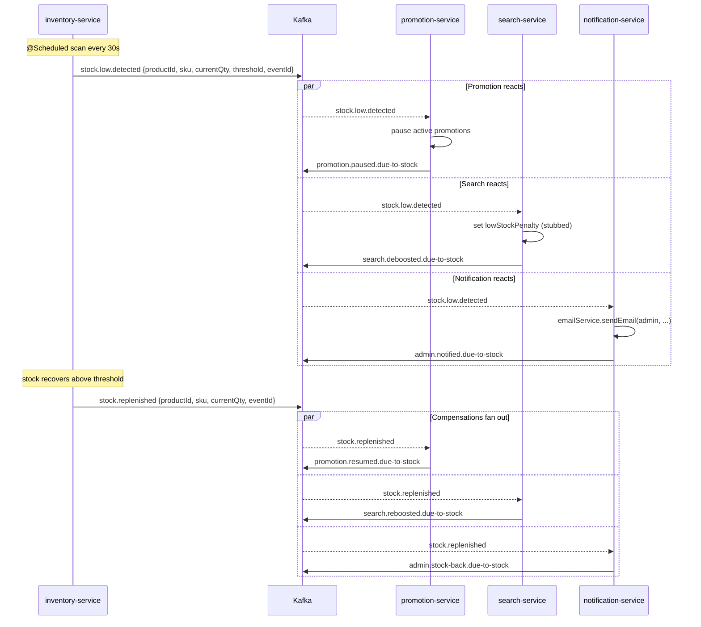

# Saga Patterns in this Project

This document is **learning material**. It compares the two distributed-transaction
patterns used here — *orchestration* and *choreography* — and points to the
concrete examples in the codebase you can read end-to-end.

A saga is a long-running business transaction split into smaller local
transactions (one per service). Sagas trade ACID guarantees for eventual
consistency, and rely on **compensating actions** instead of rollbacks.

---

## 1. Orchestration vs Choreography

| Dimension | Orchestration | Choreography |
| --- | --- | --- |
| Who drives the flow? | A central coordinator service. | Each service reacts to events. |
| Where is the flow defined? | One class — readable top-to-bottom. | Spread across many event handlers. |
| Coupling | Coordinator knows every participant. | Participants only know the events they emit / consume. |
| Adding a step | Edit the orchestrator. | Subscribe a new service to the event. |
| Debugging | Single trace; centralised log. | Distributed; needs correlation IDs. |
| Risk of cycles | Low — flow is explicit. | High — events can re-enter. |
| Best when | One team owns the workflow; logic is non-trivial. | Many teams own pieces; loose coupling matters. |
| Failure recovery | Coordinator persists state; resumes after crash. | Each service tracks its own progress. |
| Throughput | Limited by coordinator. | Naturally parallel. |

References worth reading:
- Microsoft architecture docs: *Saga distributed transactions pattern*.
- Chris Richardson, *Microservices Patterns*, ch. 4 ("Managing transactions with sagas").
- AWS Step Functions: production-grade orchestration.
- Confluent: *Microservices and the saga pattern* (event-driven choreography).

---

## 2. This Project's Examples

### 2.1 `OrderCreationSaga` — orchestration (original)

- File: `services/order-service/src/main/java/com/ecommerce/orderservice/saga/OrderCreationSaga.java`
- Tests: `services/order-service/src/test/java/com/ecommerce/orderservice/saga/OrderCreationSagaTest.java`
- What it does: cart -> reserve stock -> create order -> apply promotion -> create
  payment intent -> clear cart -> publish `order.created`.
- Style: single class, in-line steps, in-line compensation. Classic but the
  class is already approaching "god object" territory — that's what motivated
  the refactored version below.

### 2.2 `RefundOrchestrator` — orchestration (pedagogical)

- Package: `services/order-service/src/main/java/com/ecommerce/orderservice/saga/refund/`
  - `RefundOrchestrator.java` — the coordinator.
  - `RefundSagaState.java` — JPA entity persisting progress for crash recovery.
  - `RefundSagaContext.java` — per-run scratch DTO.
  - `step/` — one class per step (`ValidateRefundStep`, `ReversePaymentStep`,
    `RestoreInventoryStep`, `UpdateOrderStep`, `NotifyRefundStep`).
  - `RefundSagaRecoveryScheduler.java` — every 5 minutes, picks up sagas stuck
    `IN_PROGRESS` / `COMPENSATING` and resumes them.
- Controller: `services/order-service/src/main/java/com/ecommerce/orderservice/controller/RefundController.java`
  exposes `POST /api/orders/{orderId}/refund` and
  `GET /api/orders/refunds/{sagaId}` (admin-scoped).
- What it does: validate eligibility -> reverse payment (gRPC) ->
  restore inventory (gRPC) -> mark order REFUNDED -> publish
  `refund.completed`.
- Why a second example exists: it shows the *clean* shape of an orchestration
  saga — small `SagaStep` interface, persisted state, idempotent steps,
  recovery scheduler, controller separation. Read it side-by-side with
  `OrderCreationSaga` to see how the same pattern scales.

### 2.3 `InventoryReplenishmentChoreography` — choreography (pedagogical)

When stock for a product drops below its reorder threshold, three peer
services react in parallel without a central coordinator. When stock returns,
the same three services reverse what they did. There is no saga state row.
The flow exists only as Kafka topics and `@KafkaListener`s.

**Trigger publisher (inventory-service)**
- `services/inventory-service/src/main/java/com/ecommerce/inventoryservice/saga/replenishment/`
  - `StockLowDetector` — `@Scheduled` (default 30s) scanner that edge-triggers events.
  - `ReplenishmentEventPublisher` — emits `stock.low.detected` and `stock.replenished`.
  - `package-info.java` — the master javadoc on choreography theory; read this first.
- Tests: `services/inventory-service/src/test/java/com/ecommerce/inventoryservice/saga/replenishment/StockLowDetectorTest.java`

**Peer participants**
- `services/promotion-service/src/main/java/com/ecommerce/promotionservice/saga/replenishment/`
  — `PromotionStockListener` pauses / resumes promotions; idempotency via
  JPA table `promotion_consumed_replenishment_event`.
- `services/search-service/src/main/java/com/ecommerce/searchservice/saga/replenishment/`
  — `SearchStockListener` applies / clears a `lowStockPenalty` (stubbed save);
  in-memory dedup via `ConsumedEventStore`.
- `services/notification-service/src/main/java/com/ecommerce/notificationservice/saga/replenishment/`
  — `StockAlertListener` emails the admin via the existing `EmailService`;
  Mongo dedup collection `replenishment_consumed_events`.

**Topic contracts (all JSON)**
| Topic | Direction | Payload |
|---|---|---|
| `stock.low.detected` | inventory → all peers | `{eventId: UUID, productId: Long, sku: String, currentQty: int, threshold: int, detectedAt: Instant}` |
| `stock.replenished` | inventory → all peers | `{eventId: UUID, productId: Long, sku: String, currentQty: int, replenishedAt: Instant}` |
| `promotion.paused.due-to-stock` | promotion → audit | `{eventId, causedByEventId, productId, pausedPromotionCount, pausedAt}` |
| `promotion.resumed.due-to-stock` | promotion → audit | `{eventId, causedByEventId, productId, resumedPromotionCount, resumedAt}` |
| `search.deboosted.due-to-stock` | search → audit | `{eventId, causedByEventId, productId, deboostedAt}` |
| `search.reboosted.due-to-stock` | search → audit | `{eventId, causedByEventId, productId, reboostedAt}` |
| `admin.notified.due-to-stock` | notification → audit | `{eventId, causedByEventId, productId, adminEmail, notifiedAt}` |
| `admin.stock-back.due-to-stock` | notification → audit | `{eventId, causedByEventId, productId, adminEmail, notifiedAt}` |

**Sequence diagram**

**Pedagogical contrast points to look for**
- No saga state row anywhere — each service tracks its own progress in a
  per-service dedup table / set.
- Compensation is itself an event (`stock.replenished`) — not a method call
  on a `SagaStep`.
- The flow exists only as a sequence of Kafka topics. Compare to
  `RefundOrchestrator.execute()` where the workflow is a method body you can
  read top to bottom.
- Adding a fourth participant (e.g. analytics) is a new `@KafkaListener` in
  a new service — zero edits to inventory-service or its peers.
- No saga timeout, no recovery scheduler, no global retry policy.

---

## 3. When to use which

Rules of thumb:

1. **Default to orchestration when a single team owns the workflow.** The
   coordinator gives you one place to read, debug and instrument the flow.
2. **Choose choreography when teams own the participants but no one owns the
   end-to-end flow.** Loose coupling is worth the cognitive cost.
3. **Combine them.** Big sagas often have an orchestrator at the top and
   choreography between leaf services.
4. **Always persist saga state when running orchestration**, even if it feels
   over-engineered for a small flow. The first time the JVM dies mid-saga you
   will be very glad you did.
5. **Compensations are not rollbacks.** They are real business actions
   (re-charge, restock, send "sorry" email) and must be designed up front.
   The default no-op `compensate()` in `SagaStep` is fine for read-only or
   best-effort steps; everything else needs a thought-through reverse.
6. **Every step must be idempotent.** Recovery schedulers, network retries
   and at-least-once message delivery all replay steps. Use idempotency keys
   (`restorationId`, `refundTransactionId`) and let participants short-circuit
   on duplicate calls.
7. **Use choreography when adding a new participant should not require code
   changes elsewhere.** The replenishment saga proves the point: a future
   analytics-service that wants to log low-stock incidents can subscribe to
   `stock.low.detected` and ship independently — no edits to
   inventory-service, promotion-service, search-service or
   notification-service. The same change against `RefundOrchestrator` would
   touch the orchestrator class, the `RefundSagaContext` DTO, and the step
   ordering.

---

## 4. What's NOT in this project

We deliberately avoid saga frameworks (Axon, Eventuate, Temporal). The
mechanism is hand-rolled in ~500 lines so you can read it. In production code
you might adopt a framework once you have 3+ sagas — but only after you
understand the bare-metal version.
