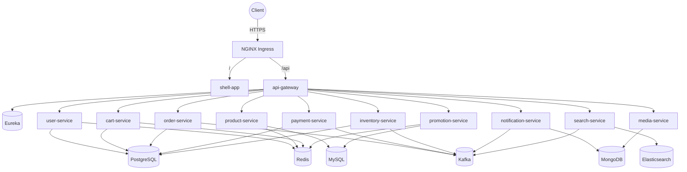

# Kubernetes Manifests

Kustomize-based manifests for the e-commerce platform.

## Layout

```
k8s/
├── base/                      # Environment-agnostic resources
│   ├── namespace.yaml
│   ├── infra/                 # eureka, config-server, api-gateway
│   ├── backend/               # 10 microservices
│   ├── frontend/              # shell-app + 5 MFEs
│   ├── policies/              # NetworkPolicy (default deny + allows)
│   ├── ingress/               # NGINX ingress
│   ├── cronjobs/              # DB backups
│   ├── hpa.yaml               # HPAs for product/order/payment
│   └── kustomization.yaml
└── overlays/
    ├── staging/               # smaller replicas/resources, staging tags
    └── production/            # prod resources, immutable SemVer tags
```

## Architecture



## Prerequisites

- A Kubernetes cluster (>= 1.28)
- `kubectl`, `kustomize` (built into kubectl since 1.14)
- An ingress controller (NGINX) and `cert-manager` if using Let's Encrypt
- A container registry containing `ecommerce/<service>:<tag>` images

## Apply

```bash
# Validate first (no cluster contact required)
kubectl apply --dry-run=client -k k8s/base
kubectl apply --dry-run=client -k k8s/overlays/staging
kubectl apply --dry-run=client -k k8s/overlays/production

# Real apply
kubectl apply -k k8s/overlays/staging
kubectl apply -k k8s/overlays/production
```

## Secrets

The base manifests reference two secrets that you MUST create out-of-band. Do NOT commit them.

> `INTERNAL_SERVICE_TOKEN` is the shared inter-service credential
> (`X-Internal-Service-Token`) that authorizes `POST /api/promotions/apply`.
> promotion-service AND order-service both **fail fast at boot** without it when
> `SECURITY_ENABLED=true`, and the value must be identical in both. Watch the
> `promotion.apply.auth_failure` counter / `PromotionApplyAuthFailure` alert after
> rotating it: while the two sides disagree, promotion usage limits are not enforced.
> Under ESO it is sourced from the shared Vault path `internal.service_token`
> (see `secrets/services/*-externalsecret.yaml`).

```bash
# Application credentials
kubectl create secret generic ecommerce-secrets \
  -n ecommerce-prod \
  --from-literal=POSTGRES_USER='...' \
  --from-literal=POSTGRES_PASSWORD='...' \
  --from-literal=MYSQL_USER='...' \
  --from-literal=MYSQL_PASSWORD='...' \
  --from-literal=MONGO_INITDB_ROOT_USERNAME='...' \
  --from-literal=MONGO_INITDB_ROOT_PASSWORD='...' \
  --from-literal=REDIS_PASSWORD='...' \
  --from-literal=ELASTIC_PASSWORD='...' \
  --from-literal=AUTH0_ISSUER_URI='...' \
  --from-literal=AUTH0_AUDIENCE='...' \
  --from-literal=AUTH0_DOMAIN='...' \
  --from-literal=STRIPE_API_KEY='...' \
  --from-literal=INTERNAL_SERVICE_TOKEN="$(openssl rand -base64 48)"

# Backup credentials (S3)
kubectl create secret generic backup-secrets \
  -n ecommerce-prod \
  --from-literal=AWS_ACCESS_KEY_ID='...' \
  --from-literal=AWS_SECRET_ACCESS_KEY='...' \
  --from-literal=S3_BUCKET='ecommerce-backups-prod'

# Config server git creds
kubectl create secret generic config-server-secrets \
  -n ecommerce-prod \
  --from-literal=CONFIG_GIT_URI='https://...' \
  --from-literal=CONFIG_GIT_USERNAME='...' \
  --from-literal=CONFIG_GIT_PASSWORD='...'
```

### Recommended: Sealed Secrets

For GitOps workflows, use [bitnami-labs/sealed-secrets](https://github.com/bitnami-labs/sealed-secrets):

```bash
kubectl create secret generic ecommerce-secrets --dry-run=client -o yaml \
  --from-literal=POSTGRES_PASSWORD='...' \
  | kubeseal --format=yaml > k8s/overlays/production/sealed-secrets/ecommerce-secrets.yaml
```

The resulting `SealedSecret` is safe to commit; only the cluster's controller can decrypt it.

Alternatives: HashiCorp Vault + the External Secrets Operator, or AWS Secrets Manager via ESO.

## Environment-driven values

Manifests carry no hardcoded environment specifics. These are rendered at deploy time
(via `envsubst` before `kubectl apply` / `kustomize build`, or by CI):

| Variable | Where |
|----------|-------|
| `IMAGE_REGISTRY` | overlay `images[].newName` (default `ghcr.io/ecommerce-platform`) |
| `BASE_DOMAIN` | `base/ingress/ingress.yaml`, `cert-manager/certificate.yaml` |
| `ACME_EMAIL` | `cert-manager/cluster-issuer.yaml` |
| `ES_SNAPSHOT_BUCKET`, `AWS_S3_REGION` | `dr/elasticsearch-snapshot.yaml` |
| `KAFKA_SOURCE_BOOTSTRAP`, `KAFKA_DR_BOOTSTRAP` | `dr/kafka-mirrormaker2.yaml` |
| `KAFKA_BOOTSTRAP_SERVERS` | `kafka/kafka-acls-job.yaml` |

See `.env.example` / `.env.template` for the full list.

## Sub-directories

| Dir | Purpose |
|-----|---------|
| `cert-manager/` | Let's Encrypt ClusterIssuers + `ecommerce-tls` Certificate |
| `secrets/` | Vault + ESO ClusterSecretStore, shared + per-service ExternalSecrets |
| `dr/` | Elasticsearch snapshot CronJob + Kafka MirrorMaker 2.0 |
| `kafka/` | Per-SASL-principal broker ACL init Job |

## Open Items For Production Go-Live

- The ingress host + TLS SANs are env-driven (`${BASE_DOMAIN}`); confirm DNS resolves to the ingress before ACME issuance.
- TLS is provisioned by `cert-manager/` (ClusterIssuer + `ecommerce-tls` Certificate).
- Images are pulled from `${IMAGE_REGISTRY}` (GHCR default) — overlay `images:` are env-driven.
- Secret backend finalized: HashiCorp Vault + External Secrets Operator (`secrets/README.md`, `helm/vault/`).
- Wire data tier (PostgreSQL/MySQL/MongoDB/Kafka/Elasticsearch) — these manifests assume those run as in-cluster StatefulSets or as managed services. A managed-DB approach is recommended for prod.
- Configure pod disruption budgets per StatefulSet for data-tier components.
